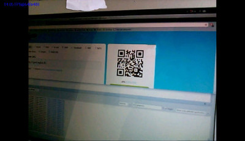

# Réalité augmentée

J'ai réalisé ce projet avec deux autres personnes,
[Cindy Becher](https://www.linkedin.com/in/cindy-becher-88b36ab4/) et
[Alexandre Fortuna](https://www.linkedin.com/in/alexandre-fortuna-73a634146/). Il nous fallait développer des briques
logicielles pour détecter des QR Codes et des feuilles blanches. A la base, nous devions faire de la gestion de projet,
mais comme le sujet se découpait en 2 parties bien distinctes, j'ai travaillé seul sur la partie QR Code et ils se sont
chargés de la partie feuille blanche.

Je devais détecter un QR Code, le recaler et le lire, pour ensuite afficher un modèle 3D dessus en
fonction du contenu du QR Code (modèle dans le QR Code ou URL vers un modèle). Pour simplifier les choses, j'ai
développé deux applications différentes, une pour la lecture de QR Codes et l'autre pour faire de l'affiche 3D avec
OpenGL. Je n'ai pas réussi à assembler les deux par manque de temps. Les deux applications présentent des exemples
d'utilisation de JNI (code natif C++ appelé par Java), et celle faisant de l'affichage OpenGL montre également
comment appeler du Java depuis C++.

De leur côté, ils devaient détecter une feuille blanche et afficher une image dessus. En plus de finir leur
application sur <i>smartphone</i>, ils avaient réussi à la porter sur les lunettes Epson Moverio BT-300. Le résultat
fut décevant et nous avions ainsi conclu que ces lunettes n'étaient pas adaptées à ce genre d'applications. Je me
suis permis de reprendre la structure de leur code (pas le fond) pour l'homogénéiser avec le mien, afin de le
proposer ici.

Pour faire fonctionner les applications `QRCodeApp` et `BlankPaperApp`, il faut déjà avoir
installé `OpenCVManager` sur sa tablette (l'application `GLApp` quant à elle ne nécessite
aucun apport extérieur). Pour l'application `QRCodeApp`, il faudra suivre le `README.md`
fourni pour qu'Android Studio puisse compiler le code C++ avec `OpenCV` en natif (ouais je sais, c'est
assez lourd).

