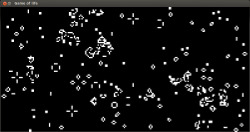

# Game of life

Un très grand classique lorsque l'on débute l'informatique. Enfin, il ne faut pas non plus essayer trop tôt, mais
ce peut être un bon objectif pour se tester dans un langage.

Inventé par Conway, et basé sur le principe des automates cellulaires, cet automate en 2D est censé être basé sur
des évolutions tirées de la génétique.

Le jeu se décompose comme un tableau en 2D, chaque case étant soit morte, soit vivante (0 ou 1). Un case nait si
elle a exactement 3 voisins vivants, reste dans son état si c'est 2, et meurt dans les autres cas.

Si le nombre de voisins vivants est plus petit que 2, c'est la mort par isolement, dans le cas où le nombre est
supérieur à 3, c'est la mort par étouffement.

Le programme comporte plusieurs formes déjà prédéfinies dans le dossier `./models`. Pour en définir une
nouvelle, il suffit de rajouter un fichier (de n'importe quelle extension), et de s'inspirer des autres. Les
coordonnées (0, 0) représentent la case sous le curseur de la souris.

La `SDL 2` est requise pour compiler et exécuter le programme.
