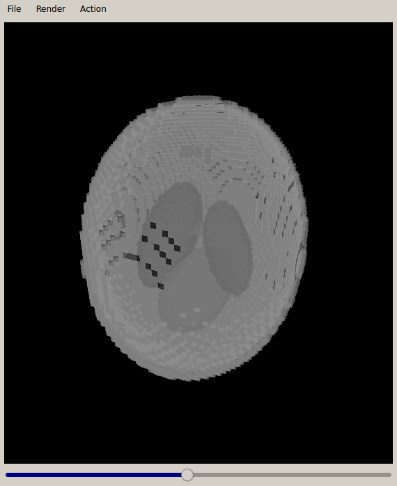

## 3D viewer

Ce modeste logiciel permet de visualiser des objets 3D aux formats PGM3D et OBJ. Il est issu d'un cours de mon master 2
en informatique pour l'image et le son.

Étant donné qu'il se base sur Qt4 pour fonctionner, il est à peu près inutilisable aujourd'hui. Je l'ai quand même mis
ici pour présenter les opérations qui nous avait été demandées d'implémenter, à savoir la décimation et la réparation
de maillages.
