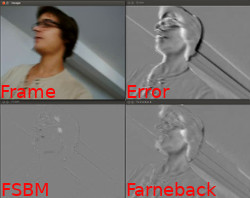

# Motion analyser

Lors de ma 2nde année de mon master autour de l'image et du son, j'ai eu à me servir d'OpenCV pour faire des
traitements vidéos d'estimation de mouvements pour compenser des images. Afin de rendre les choses plus simples à
utiliser, j'ai rassemblé les différents codes de TDs pour en faire un programme unique.

Le principe est de calculer le déplacement des pixels (ou de groupe de pixels) d'une image par rapport à celle qui
la précède dans un flux vidéo. Si l'estimation des déplacements est acceptable, il devient alors possible de
reproduire une image à partir de la précédente en utilisant cette estimation.

Dans ce programme, je présente deux méthodes : une qui fait une recherche exhaustive dans les images pour rechercher
les meilleurs déplacements possibles (_Full Search Block Matching_), et une autre basée sur un algorithme de
Farneback. Le FSBM exploite la cohérence d'un flux vidéo pour s'éviter d'explorer l'entiereté des images, et fait
ainsi ses recherches dans des fenêtres de taille prédéfinie.

La méthode FSBM est plus précise que celle basée sur l'estimation de Farneback, mais elle est plus coûteuse en
temps.
