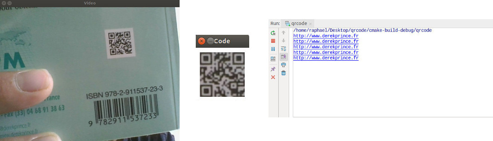

# QR Code reader

Lors de ma dernière année de master image, j'ai dû développer une application Android qui devait lire des QR Codes.
A cause de la direction qu'a pris le développement, j'ai cherché à faire du C++ pour accélérer les traitements.
Cette approche fut fort pratique, car j'ai pu commencer le développement directement sur mon PC, en m'inspirant très
fortement d'un tutoriel en ligne.

En utilisant OpenCV, il fallait détecter un QR Code et le mettre "à plat" face caméra pour faciliter la lecture.
J'ai intégré ensuite un portage C++ de la bibliothèque Java Zxing assez connue pour la lecture de QR Code.

Les résultats sont acceptables mais pas particulièrement précis, Zxing n'arrivant pas à lire les codes en cas de
luminosité trop faible. Il faut donc veiller à tester le programme avec une luminosité importante pour avoir des
résultats rapidement.

Par ailleurs, l'application finale sous Android est disponible
[ici](https://github.com/rjorel/tot-box/tree/master/android/augmented-reality), qui expose aussi une application
détectant une feuille blanche pour afficher une image dessus.
