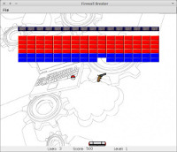
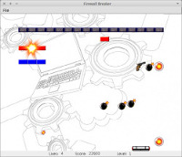

# Breakout

Un petit jeu de _Breakout_, en voilà une bonne idée. En fait, j'ai eu ce projet (avec
[Antoine Laulan](https://www.linkedin.com/in/antoinelaulan/)) au premier semestre de mon M2, dans lequel nous devions
utiliser une bibliothèque écrite par les profs de la fac.

Je n'ai pas vraiment compris l'idée derrière ce projet, parce la matière avait pour but de nous enseigner les
_design patterns_ et finalement, à part un seul que nous avons utilisé, le reste a été une bataille avec la
bibliothèque pour la comprendre et tenter de faire notre jeu.

Eh bien figurez-vous que nous ne sommes pas parvenus à faire le truc le plus basique d'un _Breakout_,
c'est-à-dire des rebonds corrects. Et ne nous prenez pas pour des boulets, la bibliothèque permettait difficilement
de le faire.. mais tout est expliqué dans le rapport.

Bon sinon, parce que c'est plus drôle quand même, nous avons rajouté quelques petits bonus dans le jeu, histoire de
varier un peu les parties.
