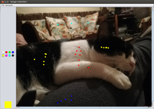

# Statistics

Ce petit projet m'est venu à la suite d'un échange avec un pote de sport. Il avait besoin d'un programme qui
permettait de placer des points de différentes couleurs sur une image, pour ensuite savoir leurs proportions.

Une gestion de plusieurs images était souhaitée, et donc des statistiques sur l'ensemble des images ainsi que sur
chaque image une par une pouvaient être intéressantes. La possibilité de définir ses propres couleurs était aussi
une bonne idée.

Du coup, je me suis lancé là-dessus en Java, car la personne comptait le faire avec ce langage. J'ai ajouté la
possibilité de sauvegarder la position des points sur une image pour pouvoir les réimporter.

Pour une édition possible sur des images trop grandes, la gestion du _scrolling_ était évidemment obligatoire.
La configuration des couleurs se fait via un fichier XML, la sauvegarde des points également sous ce format, et les
statistiques sont stockées au format CSV.
