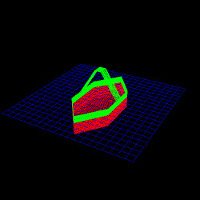
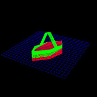

# Turbine

Voici un petit applet Java que j'ai écrit en fin de première année de Master pour une entreprise.

Il s'agissait de modéliser en 3D la rotation sur les 3 axes d'une hydrolienne, pour voir comment elle pencherait en
fonction des perturbations extérieures une fois mise à l'eau.

L'implémentation de la projection des points 3D sur un plan 2D n'est pas de moi, mais j'ai créé tout le reste.
Ne vous attendez pas à un rendu parfait, notamment parce que l'applet ne gère pas du tout les notions de profondeur
en fonction de l'endroit d'où l'on regarde (de ce fait, certains points "plus loin" peuvent chevaucher des points
"plus près").

Pour que cela soit plus lisible, il était pratique de pouvoir couper l'hydrolienne en deux sections par rapport au
plan de l'eau. Ainsi l'on voyait bien la partie immergée et la partie hors de l'eau. J'ai donc écrit une fonction de
découpe selon un plan quelconque, pour que cela soit plus adaptable.

Afin d'exécuter l'applet simplement, je vous conseille de vous servir d'[IntelliJ](https://www.jetbrains.com/idea/), qui
permet de le faire en fournissant un contexte d'exécution sans passer par un navigateur.
