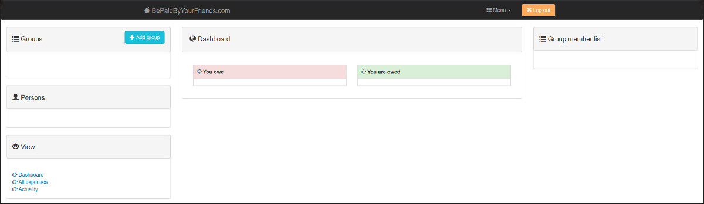

# Bills

Le fric, ça parle à tout le monde non ? Au premier semestre de M2, j'ai eu un petit projet avec
[Antoine Laulan](https://www.linkedin.com/in/antoinelaulan/) et
[Guillaume Verdugo](https://www.linkedin.com/in/guillaume-verdugo-a79601b1/) où l'on devait copier les fonctionnalités
d'un site existant qui permettait de gérer des factures de groupes, comme par exemple pour faire les comptes dans une
coloc'. Donc il fallait la possibilité de faire des groupes, de mettre des personnes dedans et de rajouter des factures
tout en permettant de partager les coûts, etc..

Quelle utilité me demanderez-vous (ou pas, si vous vous en foutez (ça va, je rigole (ça fait beaucoup de parenthèses
d'un coup là))) ? Eh bien à part nous faire bosser la stack
[MEAN](https://en.wikipedia.org/wiki/MEAN_(solution_stack)), je ne sais pas trop.. parce que le prof semblait vraiment
manquer d'inspiration en nous donnant ce projet.

Comme le sujet principal était l'argent, nous avons bien déliré autour du cash.. mais cela pourrait passer pour de
l'humour de mauvais goût par endroit.
