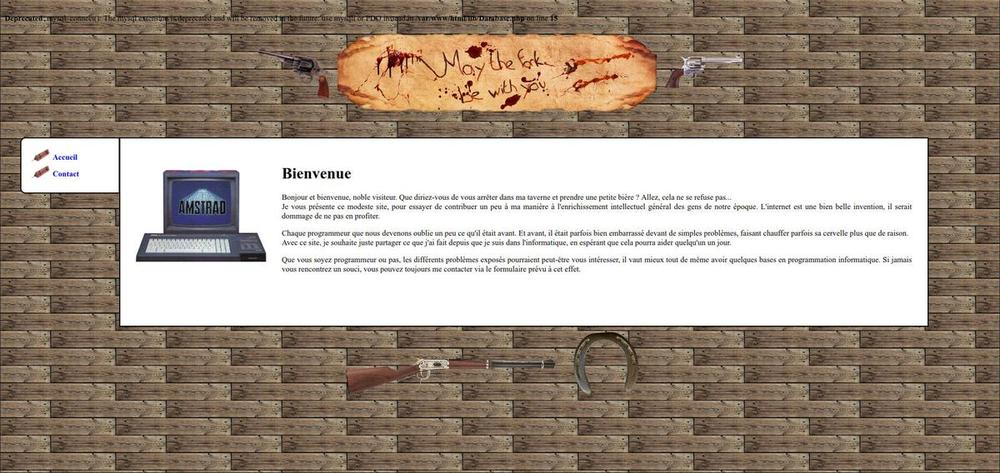

Voici la première version de mon site web. Il avait pour but principal de partager mes projets d'étude et autres
projets personnels que je trouvais intéressants. Le moins que l'on puisse dire, c'est qu'il n'avait pas un style
très conventionnel.. Si je le partage, c'est simplement pour présenter une architecture simplifiée tentant de
répondre au _pattern_ MVC.

Pour une meilleure compréhension, j'ai commenté les parties qui me semblaient importantes (en français). Comme ce
code a plusieurs années maintenant, le style est assez différent de celui que j'ai maintenant. Je l'ai repris à
certains endroits pour le clarifier tout de même, mais l'esprit reste le même qu'alors. J'ai laissé la partie dédiée
à l'administration du site, bien qu'elle soit assez "foireuse" d'un point de vue de l'organisation des fichiers. Ne
soyez donc pas étonné de voir différents styles de code cohabiter (ou carrément des messages en anglais et d'autres
en français dans la partie dédiée à l'administration).

Le site utilise une interface PHP-MySQL assez datée. Cela est dû au premier hébergeur du site, à savoir Free, qui ne
proposait pas d'interface plus récente à ce moment-là (je pense à __PDO__ particulièrement). La gestion de la
base de donnée n'est donc pas excellente, mais j'ai rajouté de quoi lancer le site avec _Docker_ et _Docker
Compose_. Après avoir fait `docker-compose up`, le site sera disponible à l'adresse
[http://localhost:8000/](http://localhost:8000/). Pour initialiser la base de donnée, il faudra taper la commande
`docker-compose exec -T database mysql -u root -psecret homestead < database.sql`.
