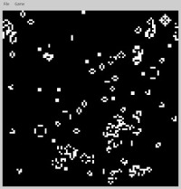

# Game of life

Après avoir fait ce programme en C, je me suis amusé à l'écrire en Python et faire l'interface graphique non plus
avec la SDL mais avec PyQt.

Evidemment, Python n'est pas le langage de choix pour faire des programmes rapides, et dans ce cas-là, il est facile
de voir ses limites dès lors que l'on veut traiter trop de cellules. Mais il permet de faire des modules C/C++ pour
rendre plus rapides des parties critiques d'un programme, et propose des structures de données ainsi que des
fonctions pour manipuler les objets du langage.

J'ai ainsi écrit la gestion du jeu de la vie comme un module C/C++ avec une classe Python encapsulant les appels
aux fonctions du module, afin d'abstraire ces dernières pour le reste du programme.
