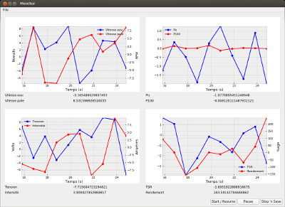

# Monitor

Pour faire des graphiques en Python, Matplotlib s'impose bien souvent. Lors d'un projet pour son entreprise, un ami
cherchait à afficher en temps réel des données en provenance d'un Arduino.

Il se trouve que Matplotlib peut être intégré dans Tkinter ainsi que PyQt.. je me suis alors proposé de l'aider à
réaliser le programme, histoire d'avoir rapidement quelque chose de fonctionnel.

Après avoir testé l'intégration avec Tkinter, nous nous sommes dirigés vers PyQt car le _look 'n' feel_ des
applications Qt est quand même plus sympa (à mon goût), et le placement des composants graphiques plus simple.

Le programme présente donc des données à afficher qui étaient très spécifiques aux demandes de l'entreprise, mais il
n'est pas dur de l'adapter à d'autres situations. Des données aléatoires sont générées lorsqu'aucun Arduino n'est
branché à l'ordinateur, ceci afin de pouvoir tester le programme sans matériel.
