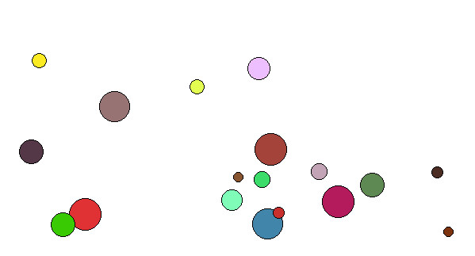

# Physics

Lors de mon master 2 en informatique pour l'image et le son, j'ai travaillé sur des simulations d'interactions entre
particules.

J'ai reproduit en Python et avec PyQt5 une partie de mes cours, i.e. l'interaction des particules avec des murs, mais je
n'ai jamais réussi à simuler les collisions entre particules.. j'avais cherché à implémenter les équations au plus
proche de ce que mes cours disaient, mais il faut croire que je n'étais pas assez bon pour le faire correctement 😁.

La simulation que j'ai faite se contente donc de gérer les collisions des particules avec les murs du décor, en se
basant sur un système d'_Ordinary Differential Equation_ pour calculer les différentes étapes.
