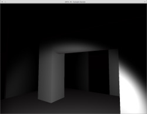

# FPS

Ceci est mon premier petit jeu que j'ai trouvé assez abouti pour le "publier". C'est un plateformer 3D classique, à
l'exception près que vous serez dans le noir total, seulement aidé d'une lampe éclairant vos pieds.

Comme c'est mon premier projet, je n'ai pas fait de choses particulières quand vous accomplissez le parcours. Par
contre si vous tombez, c'est retour à la case départ. Le but est juste d'aller de la première plateforme à la
dernière.

Étant un grand fan de Linux, je propose le jeu sous ce dernier en plus de Windows. Mais force est de constater que
Windows le fait tourner mieux. Et le plus étonnant, c'est que sous Linux il y a un problème à l'initialisation, il
semble que la caméra (ou la position de départ) ne soit pas toujours la même d'une exécution à l'autre.

Les deux versions proposées sont pour les processeurs 64 bits. Je mets aussi le _package_ Unity, si jamais vous
êtes curieux de voir comment j'ai réalisé le jeu.

__EDIT :__ J'ai retravaillé mon jeu après quelques cours en plus, et quelques mois aussi. J'ai produit cette fois
le résultat sur Windows seulement, ma version Unity sur Windows ne proposant pas de _build_ sous Linux. La
version Linux est donc encore la première, celle sur Windows est légèrement améliorée.

En fait, j'ai juste ajouté des messages et amélioré le système de retour à la case départ, ainsi que fait pointer la
torche dans la direction du regard du joueur plutôt que vers ses pieds. Il est également possible de quitter le jeu
avec la touche `Echap` ; dans la première version, seul un `Alt + F4` permettait de le quitter..
